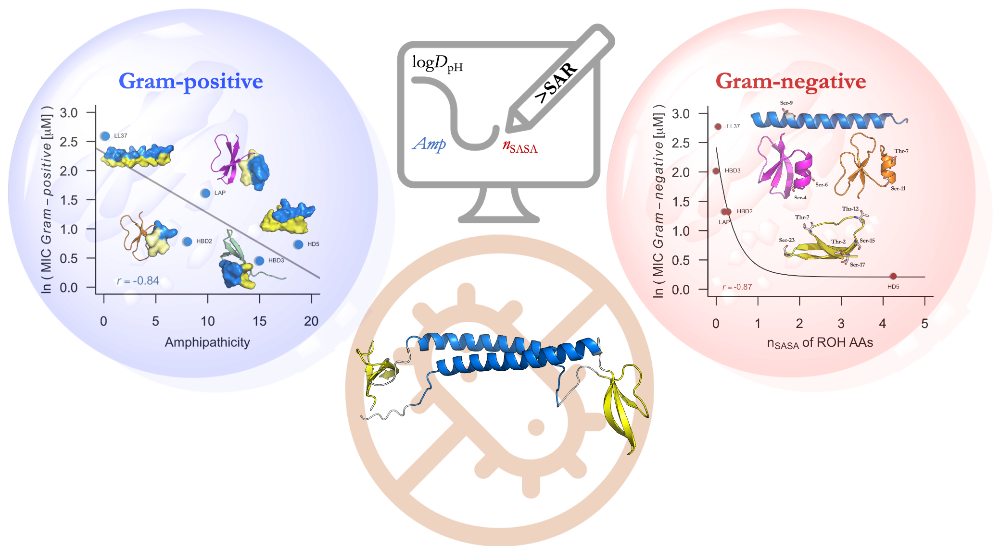
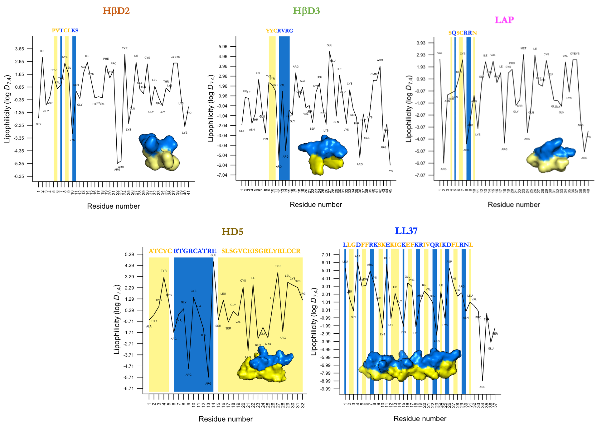

# SAR RECOMBINANT HDPs

Repository of supplemental information used in the paper: 

**Structure–Antimicrobial Activity Relationships of Recombinant Host Defense Peptides Against Drug-Resistant Bacteria**

Sergio Travé-Asensio1, Aida Tort-Miró1, Silvana Pinheiro2,3, Elena Garcia-Fruitó1*, Anna Arís1*, William J. Zamora2,3,4*
1. IRTA, Torre Marimon, Ctra C-59, Km 12,1, 08140 Caldes de Montbui, Barcelona, Spain
2.	CBio3 Laboratory, School of Chemistry, University of Costa Rica, San Pedro, San José, Costa Rica.
3.	Laboratory of Computational Toxicology and Artificial Intelligence (LaToxCIA), Biological Testing Laboratory (LEBi), University of Costa Rica, San Pedro, San José, Costa Rica.
4.	Advanced Computing Lab (CNCA), National High Technology Center (CeNAT), Pavas, San José, Costa Rica
   

Host defense peptides-based therapeutics represent a valuable class of antimicrobial agents with the potential to address the growing threat of antimicrobial resistance (AMR). Here, we have designed recombinant constructs which are the result of the combination of different host defense peptides (HDPs) to the GFP protein and multidomain proteins combining three or four HDPs, referred as 1st and 2nd generation antimicrobials, respectively. These recombinant peptides were tested against gram-positive (methicillin-susceptible, methicillin-resistant Staphylococcus aureus, and methicillin-resistant Staphylococcus epidermidis) and gram-negative (P. aeruginosa) bacteria associated in healthcare-associated infections. 

Furthermore, a state-of-the-art approach to calculate lipophilicity and amphipathicity together with molecular docking studies provided insight into the antimicrobial structure-activity relationships of these biomolecules. 

The attached figure refers to the representation of the amino acid lipophilicity profile of the HDPs domains of five 1st generation antimicrobials. The amino acids responsible for forming the hydrophilic and hydrophobic faces in the HDPs are represented by blue and yellow rectangles, respectively

